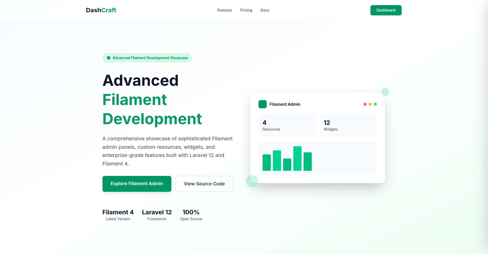
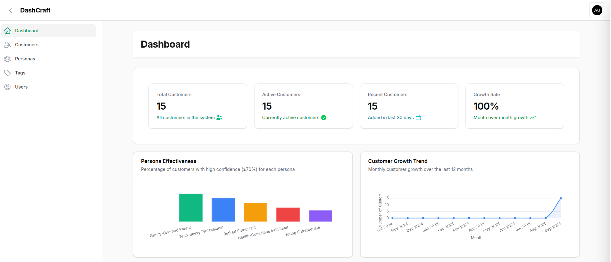
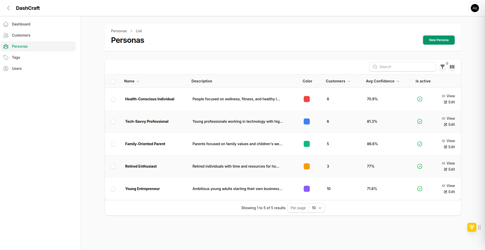

# DashCraft - Filament Expertise Showcase

[](https://laravel.com)
[](https://filamentphp.com)
[](https://livewire.laravel.com)
[](https://tailwindcss.com)
[](https://php.net)
[](https://opensource.org/licenses/MIT)

<div align="center">
  
  <p><em>🚀 A comprehensive demonstration of advanced Filament development skills</em></p>
</div>

## 🎯 **Filament Expertise Portfolio**

This project serves as a **comprehensive showcase of advanced Filament development capabilities**, demonstrating proficiency in building sophisticated admin panels, custom resources, widgets, and complex business logic integration. Perfect for demonstrating Filament expertise to potential employers and clients.

**Built with Laravel 12, Filament 4, and Livewire** - showcasing the latest features and best practices in modern PHP admin panel development.

## 📸 **Filament Admin Screenshots**

<div align="center">
  
  
  <div style="display: flex; gap: 20px; justify-content: center; flex-wrap: wrap;">
    <div style="text-align: center;">
      
      <p><strong>📊 Advanced Dashboard</strong><br>Real-time widgets & analytics</p>
    </div>
    <div style="text-align: center;">
      
      <p><strong>👥 Custom Resources</strong><br>Complex relationships & forms</p>
    </div>
  </div>
</div>

## 🚀 **Filament Skills Demonstrated**

### 🎯 **Advanced Filament Development**
- **📊 Custom Resources**: Sophisticated Customer, Persona, Tag, and User resources with complex relationships
- **📈 Dashboard Widgets**: Real-time analytics widgets with live data and interactive charts
- **🏷️ Smart Forms**: Multi-step forms with conditional fields and validation rules
- **👥 Advanced Tables**: Complex filtering, sorting, bulk actions, and custom column types
- **🔐 Filament Shield Integration**: Role-based permissions with granular access control

### 🎨 **Custom Filament Theme & UI**
- **🎨 Custom Theme**: Distinctive Filament theme showcasing design customization skills
- **📱 Responsive Design**: Mobile-first admin interface with seamless dark/light mode
- **⚡ Custom Components**: Tailored UI components and interactive elements
- **🎯 Professional Layout**: Clean, modern admin interface perfect for client demos

### 🚀 **Advanced Filament Features**
- **⚡ Filament 4 Latest**: Utilizing cutting-edge Filament 4 features and capabilities
- **🔧 Custom Actions**: Bulk operations, exports, and complex business logic
- **🛡️ Security Integration**: Filament Shield with role-based permissions
- **🔄 Livewire Integration**: Reactive components and real-time updates
- **📦 Production Ready**: Optimized for deployment with comprehensive configurations

## 🛠️ **Filament Technology Stack**

- **🎯 Core Framework**: Laravel 12.x (Latest LTS)
- **⚡ Admin Panel**: Filament 4.x (Cutting-edge features)
- **🔄 Reactive UI**: Livewire 3.x (Real-time components)
- **🎨 Styling**: Tailwind CSS 4.x (Modern utility-first CSS)
- **🗄️ Database**: SQLite (dev), MySQL/PostgreSQL (production)
- **🔐 Security**: Filament Shield (Role-based permissions)
- **🧪 Testing**: Pest PHP (Modern testing framework)
- **📏 Code Quality**: Laravel Pint, PHPStan (Professional standards)

## 📋 Requirements

- PHP 8.2 or higher
- Composer
- Node.js 18+ and NPM
- SQLite/MySQL/PostgreSQL

## 🚀 Quick Start

### Prerequisites
- PHP 8.2 or higher
- Composer
- Node.js 18+ and NPM
- SQLite/MySQL/PostgreSQL

### Installation

1. **Clone the repository**
   ```bash
   git clone https://github.com/usafhassan/dashcraft.git
   cd dashcraft
   ```

2. **Install dependencies**
   ```bash
   composer install
   npm install
   ```

3. **Environment setup**
   ```bash
   cp .env.example .env
   php artisan key:generate
   ```

4. **Database setup with demo data**
   ```bash
   php artisan migrate
   php artisan db:seed --class=DemoDataSeeder
   ```

5. **Build assets**
   ```bash
   npm run build
   ```

6. **Start the development server**
   ```bash
   php artisan serve
   ```

### 🎯 Demo Access

After seeding, you can access the application with these demo accounts:

- **Admin**: `admin@dashcraft.com` / `password`
- **Manager**: `manager@dashcraft.com` / `password`  
- **Viewer**: `viewer@dashcraft.com` / `password`

Visit `http://localhost:8000` for the welcome page or `http://localhost:8000/admin` for the admin panel.

## 🎯 **Key Filament Features**

### **Advanced Resources & Relationships**
- Sophisticated Customer, Persona, Tag, and User resources with complex many-to-many relationships
- Custom form schemas with conditional fields and advanced validation
- Bulk operations and mass actions with custom business logic

### **Dashboard & Analytics**
- Real-time dashboard widgets with live data and interactive charts
- Custom KPI widgets and business intelligence components
- Responsive admin interface optimized for all devices

### **Security & Permissions**
- Filament Shield integration with role-based access control
- Granular permissions for resources and actions
- Complete user management with role assignment

## 🧪 **Testing & Quality**

```bash
# Run all tests
php artisan test

# Run specific test suites
php artisan test --filter=DashboardTest
php artisan test --filter=AuthenticationTest
```

## 📈 **Performance & Optimization**

- Database indexing optimized for Filament table performance
- Eager loading to prevent N+1 queries in Filament resources
- Strategic caching for dashboard widgets
- Minified CSS/JS with Vite bundling
- Custom Filament theme optimization

## 🎨 **Design & Responsiveness**

- Custom Filament theme with professional color palette
- Fully responsive design (Desktop, Tablet, Mobile)
- Modern typography with Inter font family
- Consistent 8px grid system and reusable components

## 🚀 **Filament Production Deployment**

DashCraft demonstrates production-ready Filament deployment with comprehensive configurations and optimizations.

### 📋 Quick Production Setup

1. **Environment Configuration**
   ```bash
   cp .env.example .env
   # Configure production settings (see DEPLOYMENT.md)
   ```

2. **Database & Assets**
   ```bash
   php artisan migrate --force
   php artisan db:seed --class=DemoDataSeeder
   npm run build
   php artisan optimize
   ```

3. **Performance Optimization**
   ```bash
   php artisan config:cache
   php artisan route:cache
   php artisan view:cache
   composer install --optimize-autoloader --no-dev
   ```

### 📖 Complete Deployment Guide

For detailed production deployment instructions, server configurations, security settings, and monitoring setup, see our comprehensive **[DEPLOYMENT.md](DEPLOYMENT.md)** guide.

### 🐳 Docker Deployment

```bash
# Build and run with Docker Compose
docker-compose up -d

# Or build manually
docker build -t dashcraft .
docker run -p 8000:8000 dashcraft
```

## 📝 License

This project is open-sourced software licensed under the [MIT license](https://opensource.org/licenses/MIT).

## 🤝 **Filament Expertise Showcase**

This project serves as a **comprehensive demonstration of advanced Filament development skills**, showcasing:

- **🏗️ Complex Resource Architecture**
- **📊 Advanced Dashboard Widgets** 
- **🎨 Custom Filament Themes**
- **🔐 Filament Shield Integration**
- **⚡ Performance Optimizations**
- **🧪 Professional Testing Practices**

Perfect for demonstrating Filament expertise to potential employers, clients, and the Laravel community.

## 📞 **Contact & Collaboration**

For Filament development opportunities, consulting, or collaboration:
- **📧 Email**: usafhassan@gmail.com
- **💼 LinkedIn**: https://www.linkedin.com/in/usafhassan
- **🐙 GitHub**: Available for code review and collaboration

## 🙏 **Acknowledgments**

- **Laravel Team** - Amazing framework foundation
- **Filament Team** - Powerful admin panel that makes this showcase possible
- **Livewire Team** - Reactive components for dynamic interfaces
- **Tailwind CSS Team** - Utility-first CSS framework for beautiful designs

---

**🚀 Built with ❤️ to showcase advanced Filament development expertise**